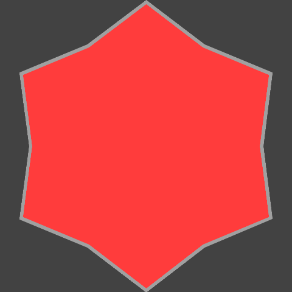
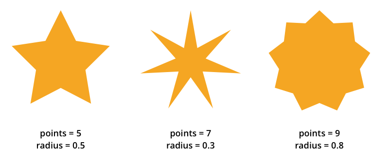

# Úkol 10

Vytvořte **přímo spustitelný** command line skript, který bude vykreslovat hvězdy podle zadaných parametrů.


```
$ ./star <width> <color> <points> <radius> <output>
```

Example:
```
./star 480 16727100 6 0.8 example-star.png 4342338 10526880 7
```



**Povinné parametry**

- `width` - výška a šířka výsledného obrázku
- `color` - barva hvězdy
- `points` - počet cípů hvězdy
- `radius` - hodnota od 0 do 1, která definuje "vykousnutí" cípů (viz obrázek)
- `output` - název souboru, do kterého se obrázek uloží

**Nepovinné parametry**

- `bgColor` - barva pozadí, výchozí hodnota je bílá
- `borderColor` - barva rámečku, pokud není zadaná, rámeček se nevykreslí
- `borderWidth` - šířka rámečku v px, pokud není zadaná, rámeček se nevykreslí



**Hodnocení**
- Povinný test (0.5b) - Vaše řešení je schopné vytvořit obrázek výše ukázaný s podobností alespoň 80%.
- Test generování (0.5b) - Vaše řešení je schopné vygenerovat všechny obrázky na správné místo, které test obsahuje a tyto obrázky budou mít správný rozměr.
- Test přesnosti (4b) - vaše řešení je podrobeno testu podobnosti vůči referenci. Test obsahuje dohromady 10 stupňů podobnosti v rozsahu od 80% do 99.92%. Každý splněný stupeň vás obdaří 0.5b. Pro porovnání se používá nejhorší ze vámy vygenerovaných.

**Poznámky**

- Výstup je ve formátu PNG, pokud název souboru, kam se má obrázek uložit končí `.png`, není potřeba ho měnit, v opačném případě je potřeba `.png` na konec přidat.
- Barvy jsou zadané jako RGB int, pro převod můžete použít např. [RGB Int Calculator](http://www.shodor.org/~efarrow/trunk/html/rgbint.html).
- Zajistěte, aby všechny parametry měly dokumentaci a zobrazily se v nápovědě (`./star --help`).
- Při vykreslování berte v potaz i šířku rámečku a přizpůsobte velikost hvězdy tak, aby se do zadané šířky a výšky vešla včetně rámečku.
- Hvězdu do obrázku umístěte tak, aby její střed byl uprostřed obrázku a jeden cíp začínal vždy nahoře uprostřed (tzn. pro lichý počet cípů nebudou ostatní cípy až ke kraji obrázku).
- Není nutné validovat hodnoty vstupních argumentů (nebude žádný "test mezních hodnot").
- Chcete-li namísto gd použít jinou grafickou knihovnu z composeru, můžete. Riskujete však, že výsledný render nebude shodný s výsledkem reference, která je psána pouze před GD.
- Pokud zvolíte jinou knihovnu než čisté GD, myslete na to, že testovací prostředí má nainstalováno pouze rošíření GD. Například knihovna ImageMagick proto fungovat nebude.
- Neupravujte jíné soubory než ty, které jsou umístěny ve složce src. Jediné vyjímky tvoří:
  - `composer.json` - máte možnost si přidat vlastní knihovny, je však požadavkem, že ke čtení vstupních paramterů bude použita knihovna `symfony/console` a že v něm zůstane `phpunit`
  - `star` - tento soubor není při testování použit a je možné ho pro vlatní testování upravit. Pro testování se provolává samotný command.
- V souboru `Tests\Public\PublicTest.php` je možné vidět porovnávací script, který vyhodnocuje podobnost obrázků. Obrázky jsou srovnávána s referečním řešením. Obrázky, které referenční řešení vygenerovalo s jejich konfigurací je možné vidět ve složce `reference`
